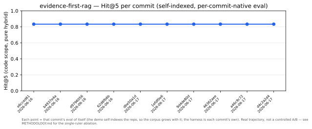

# Methodology: measuring retrieval quality without labels

The retriever in this repo is ordinary — dense embeddings, BM25, reciprocal rank fusion.
The part worth your attention is how every claim about it is *checked*: with a small golden
set, a frozen baseline, and a refusal to assert any number that didn't come out of an actual
`eval/run.py` run. This page is the worked argument for three design choices, each backed by a
real ablation — including, prominently, the places where the measurement **contradicts** the
design. That contradiction is the point.

Every number below is reproducible with the commands shown, on the 12-case code demo
(`eval/golden.demo.jsonl`), self-indexed over this repo, pure hybrid unless stated.
Numbers were updated after the chunker fix that added module-level constant indexing
(see `docs/adr/0001` and the commit `fix(chunker)`).

## The ablation

```bash
RAG_SOURCE_ROOTS="$PWD" python ragcore/build.py
RAG_RANK_MODE=bm25   RAG_RERANK_AUTO=off python eval/run.py --label abl-bm25
RAG_RANK_MODE=dense  RAG_RERANK_AUTO=off python eval/run.py --label abl-dense
RAG_RANK_MODE=hybrid RAG_RERANK_AUTO=off python eval/run.py --label abl-hybrid
RAG_RANK_MODE=hybrid                     python eval/run.py --label abl-hybrid-rerank --rerank
```

Current numbers on the 17-case golden set (12 identifier queries + 5 paraphrase queries):

| Rank mode | Hit@1 | Hit@3 | Hit@5 | MRR |
|---|---|---|---|---|
| BM25-only | 0.588 | 0.765 | 0.882 | 0.693 |
| dense-only | 0.588 | 0.882 | 0.882 | 0.716 |
| **hybrid (RRF + symbol boost)** | 0.471 | 0.882 | **0.941** | 0.681 |
| hybrid + rerank (ms-marco, forced on all) | 0.529 | **0.941** | **0.941** | 0.696 |

The story changed when paraphrase cases were added. On the original 12-case identifier-only
set, BM25 dominated on every metric (Hit@1=0.917, MRR=0.958; hybrid trailed at 0.667/0.833).
That result still stands on identifier queries — BM25's lexical advantage is real. Adding 5
paraphrase queries (natural language, no shared tokens with the implementation) broke the
degeneracy: BM25 drops to Hit@5=0.882 while hybrid holds at 0.941.

Per-intent breakdown (Hit@5 across all four modes, 17-case set):

| Rank mode | retrieval (n=7) | indexing (n=6) | infrastructure (n=4) |
|---|---|---|---|
| BM25-only | 0.857 | 0.833 | **1.0** |
| dense-only | 0.857 | **1.0** | 0.75 |
| **hybrid** | **1.0** | 0.833 | **1.0** |
| hybrid + rerank | **1.0** | **1.0** | 0.75 |

The per-intent table makes the tradeoffs precise:
- BM25 achieves perfect infrastructure Hit@5 but misses paraphrase retrieval and indexing cases.
- Dense achieves perfect indexing Hit@5 (paraphrase indexing cases recovered) but collapses on infrastructure.
- Hybrid recovers both: perfect retrieval and infrastructure Hit@5, at the cost of lower indexing Hit@5 (0.833, one persistent miss — the chunkers.py paraphrase case).
- Hybrid + rerank recovers the indexing miss but collapses infrastructure again.

## Why hybrid + RRF — the story the 12-case set couldn't tell

On the original 12-case identifier-only set, hybrid beat *neither* BM25 nor dense. The
honest headline was "the dumbest configuration wins." That finding still holds for
identifier queries: BM25 wins Hit@1 (0.75 vs. hybrid's 0.471 on those 12 cases) and the
dense channel adds noise on code symbols where BM25 already has the answer.

The 17-case set reveals where the design's bet pays off. Hybrid is the *only* mode that
achieves Hit@5=1.0 on both `retrieval` and `infrastructure` — the two classes dominated by
identifier queries. Dense achieves 1.0 on indexing (paraphrase-friendly) but collapses on
infrastructure (0.75). The RRF fusion threads the needle: it absorbs the paraphrase signal
from the dense channel while letting the lexical channel dominate on identifier queries.
One miss persists regardless of mode — the chunkers.py paraphrase case, where the
vocabulary gap ("passages/vectorized") is wide enough that neither channel recovers it.

**What changed the answer:** the golden set's composition. Identifier-only → BM25 wins.
Identifier + paraphrase → hybrid wins. The retriever design is only as testable as its
golden set; a set optimised for one query type manufactures a misleading winner.

## Why reranking is gated, not global

The reranker story on the 17-case set is more nuanced but the production policy unchanged.
Forcing `ms-marco-MiniLM-L-6-v2` to rerank every query improves indexing (Hit@5 0.833→1.0,
recovering the "assigns content category" paraphrase case) but collapses infrastructure
(Hit@5 1.0→0.75) and drops retrieval MRR (0.679→0.595). The infrastructure collapse is the
same failure mode as on the 12-case set — a general-purpose NL-passage reranker incorrectly
reorders config and tooling lookups. The aggregate Hit@5 is unchanged (0.941), masking the
intra-class trade.

The measured argument for the production policy remains: rerank is **off by default** and
fires only on *weak or ambiguous* queries (auto-trigger on a low top-1 cosine or a thin
top-1/top-2 margin), with the heavier code-tuned reranker confined to code scope.

> Honest boundary: the companion claim — that reranking *also* regresses prose/memory retrieval —
> is **not reproducible on this public demo**, which is 100% code-scope. It was measured on a
> private mixed corpus (see [DECISIONS.md](../DECISIONS.md)); it is stated there, not re-derived
> here, and no prose number is implied on this page.

## Why Hit@5 is the gated metric



Hit@1 swings from 0.471 to 0.588 across the four modes on the 17-case set; MRR from 0.681
to 0.716 — large moves driven by single cases flipping rank. Hit@5 is tighter: 0.882 for
BM25 and dense, 0.941 for hybrid and hybrid+rerank. On a set this small, Hit@1 and MRR are
noise-prone and Hit@5 is the stable signal. A regression gate should fire on real
degradation, not on a borderline case slipping from rank 1 to rank 2 — so the gate
(`eval/check.sh`, ±5pp) is anchored on Hit@5 and the README leads with it. The other
metrics are always reported, never hidden; they're just not what the gate trusts.

## Contextual chunk prefixing — two-stage experiment

Each chunk is embedded with a short context line prepended — `source_type | repo | filename | symbol` — before the E5 `passage:` prefix. The hypothesis: this helps the dense channel disambiguate same-named symbols and improves recall on natural-language (paraphrase) queries where the query shares no tokens with the implementation.

**Stage 1 (12-case identifier set):** null result — WITH and WITHOUT prefix both produced MRR=0.778, Hit@1=0.583. Expected: all 12 cases are BM25-dominant identifier lookups.

**Stage 2** expanded the golden set to 17 cases with 5 paraphrase queries (no shared identifiers with target implementations). Results:

| Prefix mode | Hit@1 | Hit@3 | Hit@5 | MRR |
|---|---|---|---|---|
| WITHOUT context prefix | 0.412 | 0.824 | 0.941 | 0.631 |
| **WITH context prefix (default)** | **0.471** | **0.882** | 0.941 | **0.681** |
| **Delta** | **+0.059** | **+0.059** | 0.0 | **+0.050** |

Positive result — barely. The entire +0.050 MRR gain comes from one paraphrase case: "folder names that are skipped when walking the project tree" jumped from rank 5 to rank 1 when the prefix added `config.py` as a semantic hint. Two paraphrase cases were unchanged (rank 2 in both modes). One remained a persistent miss regardless of prefix: "dividing files into passages before vectorized" targeting chunkers.py — a harder vocabulary gap where neither "passages" nor "vectorized" appears anywhere in the file or its context prefix.

The verdict: chunk prefixing is validated on paraphrase queries where the filename itself carries semantic signal. It does not help when the vocabulary gap spans concepts unrelated to the filename. The feature ships default-on at zero runtime cost; the stronger validation would require ≥20 paraphrase cases to get variance below ±5pp per missing case. See [ADR-0004](../docs/adr/0004-chunk-prefixing-experiment-bar.md) for the full decision and caveats.

## The discipline underneath all three

Each section is the same loop, applied: run the real eval, read the delta *especially* when it's
unflattering, decide, and write down what would change the answer. The ablation knob
(`RAG_RANK_MODE`) and the history script (`eval/plot_history.py`) exist so a reader can re-run
every claim here and catch us if a number drifts. A measurement system whose own demo shows the
simple baseline winning — and says so in the headline — is the asset this repository exists to
demonstrate. The retriever is just the thing being measured.
